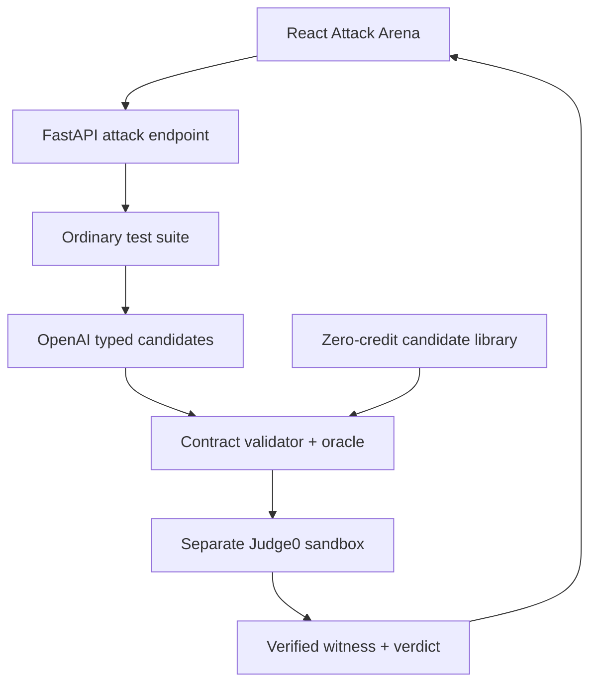

# CodeRoad

> Competitive coding where passing the obvious tests is only the first round.

CodeRoad is a real-time coding competition platform. Its Build Week feature,
the **Adversarial Test Arena**, compares two Python solutions that both pass an
ordinary test suite, asks the configured OpenAI model for structured counterexample hypotheses, and
then uses deterministic code to prove which hypotheses are valid.

The important trust boundary is simple:

> **The model proposes. Code proves.**

The configured OpenAI model never supplies the expected answer and never declares the winner. A
problem-specific oracle computes the correct answer, input contracts reject
invalid cases, and the two player programs execute in a separately hosted
Judge0 sandbox.

## What problem does it solve?

Ordinary coding tests often reward a solution that handles the examples while
still carrying a hidden assumption. For example, two implementations of
Maximum Subarray can pass tests containing positive values, while one silently
allows an empty subarray and returns `0` for every all-negative array.

The Adversarial Test Arena makes that hidden weakness visible:

1. Run both solutions against the ordinary suite.
2. Continue only when both pass.
3. Ask the configured OpenAI model for a typed batch of candidate inputs designed to distinguish
   the implementations.
4. Validate every candidate against explicit size and value constraints.
5. Compute each expected output with a deterministic oracle.
6. Execute both programs in Judge0 with CPU, wall-time, memory, file-size, and
   network limits.
7. Name a winner only when a verified input produces an XOR result: one passes
   and the other fails.

The current polished demo deliberately supports one problem contract:
**Maximum Subarray in Python**. It is a complete vertical slice, not a claim
that arbitrary programs can already be judged correctly.

## The demo moment

The preloaded solutions both pass four ordinary cases. The configured OpenAI model (or the
zero-credit fallback) proposes an all-negative input such as `[-5, -2, -8]`.
The deterministic oracle returns `-2`:

- the zero-initialized implementation returns `0` and fails;
- the non-empty implementation returns `-2` and survives;
- the UI marks the input as a verified **WITNESS** and explains the assumption
  it broke.

No response is hardcoded into the UI. The result screen is rendered from the
backend's real execution response.

## Product surfaces

### Adversarial Test Arena

- Two Monaco code editors with a clear A/B duel.
- Ordinary-suite qualification.
- Typed adversarial candidates from one bounded OpenAI Responses API call.
- Deterministic input validation and expected-output calculation.
- Isolated Judge0 execution.
- Animated candidate swarm, verified witness, and robustness verdict.
- Explicit source label: `openai` or `deterministic-fallback`.
- In-memory LRU cache for identical solution pairs, avoiding repeat model spend.

### Existing CodeRoad platform

- Registration and JWT authentication.
- Real-time matchmaking and WebSockets.
- Monaco-based coding arena.
- Match history, ratings, and leaderboard.
- Debug challenges and challenge generation.

## Architecture



The configured OpenAI model is used only for the step where language-model reasoning adds value:
reading two implementations and proposing small, diverse attacks. The
deterministic path owns all safety- and correctness-critical decisions.

## Trust and safety properties

| Claim | Enforcement |
|---|---|
| Player code never runs in the API process | `JudgeService` calls a separately hosted Judge0 API and fails closed when it is absent |
| The model cannot invent the answer | Expected outputs come from `ProblemContract.oracle` |
| Invalid model output cannot reach execution | Pydantic structured output plus deterministic length/type/range validation |
| The model cannot choose the winner | Winner is derived from independently executed pass/fail results |
| Repeated clicks do not repeatedly spend credits | Identical problem/solution pairs use a bounded in-memory LRU cache |
| Missing OpenAI access does not fake a model run | The response explicitly reports `deterministic-fallback` |
| Missing Judge0 does not run code locally | The endpoint returns `503` and labels isolated execution unavailable |
| Match rooms reject spectators/injection | WebSockets require a valid JWT and database-confirmed match membership |

## Technology

- Frontend: React 19, TypeScript, Vite 7, Monaco Editor, Lucide icons.
- Backend: FastAPI, Pydantic, SQLAlchemy, PostgreSQL or SQLite.
- AI: OpenAI Responses API with `responses.parse` and a Pydantic
  `CandidateBatch` schema; default model `gpt-4.1-mini`.
- Execution: separately hosted Judge0 CE or managed Judge0.
- Existing real-time layer: WebSockets and Redis configuration.

## Repository layout

```text
coderoad/
├── backend/
│   ├── app/
│   │   ├── api/attack_round.py
│   │   ├── schemas/attack_round_schema.py
│   │   └── services/
│   │       ├── attack_problem_registry.py
│   │       ├── attack_round_service.py
│   │       ├── counterexample_generator.py
│   │       └── judge_service.py
│   ├── tests/
│   ├── .env.example
│   └── Dockerfile
├── frontend/
│   ├── src/pages/AttackArena.tsx
│   ├── src/pages/AttackArena.css
│   ├── src/services/attackRoundService.ts
│   └── .env.example
├── BUILD_WEEK_CHANGES.md
├── SECURITY.md
├── docker-compose.yml
└── render.yaml
```

## Prerequisites

- Python 3.11+
- Node.js 20+
- npm
- A separately hosted or managed Judge0 endpoint for real code execution
- Optional: a fresh OpenAI API key for live OpenAI candidates

Do not reuse any key that has appeared in a chat, commit, screenshot, or public
deployment file. Revoke it and create a fresh key.

## Local setup

### 1. Backend

```bash
cd backend
python3 -m venv .venv
source .venv/bin/activate
pip install -r requirements-dev.txt
cp .env.example .env
```

Generate a development secret:

```bash
python -c "import secrets; print(secrets.token_urlsafe(48))"
```

Paste that value into `backend/.env` as `SECRET_KEY`.

Configure real execution:

```env
JUDGE0_API_URL=https://your-judge0-host.example
JUDGE0_AUTH_TOKEN=your-runner-token-if-required
JUDGE0_AUTH_HEADER=X-Auth-Token
JUDGE0_PYTHON_LANGUAGE_ID=71
```

For a low-volume local smoke test, Judge0's public CE endpoint documents
`wait=true` submissions. Do not send private source code to a public service;
use a runner you control for production.

Optional live OpenAI generation:

```env
OPENAI_API_KEY=your-fresh-key
OPENAI_MODEL=gpt-4.1-mini
OPENAI_TIMEOUT_SECONDS=20
OPENAI_CACHE_MAX_ENTRIES=128
ATTACK_ROUND_MAX_CANDIDATES=12
```

Without `OPENAI_API_KEY`, the arena uses its transparent deterministic boundary
library and consumes zero OpenAI credits. Without `JUDGE0_API_URL`, execution
fails closed; it never falls back to running player code on the web server.

Start the API:

```bash
uvicorn app.app:app --reload --host 0.0.0.0 --port 8000
```

Health check: `http://localhost:8000/health`

### 2. Frontend

In a second terminal:

```bash
cd frontend
npm ci
cp .env.example .env
npm run dev
```

Open `http://localhost:5173`, create an account, and choose **Attack Arena**.

## Docker backend setup

The root Compose file starts Redis and the backend, using local SQLite by
default. Set `DATABASE_URL` to use hosted PostgreSQL. Compose intentionally does
not pretend to bundle Judge0; the code-execution service must remain a separate
trust boundary.

```bash
export SECRET_KEY="$(python -c 'import secrets; print(secrets.token_urlsafe(48))')"
export JUDGE0_API_URL="https://your-judge0-host.example"
export OPENAI_API_KEY=""
docker compose up --build
```

Set a fresh `OPENAI_API_KEY` only when you want live model generation.

## API

All Attack Arena endpoints require a normal CodeRoad bearer token.

### List supported attack contracts

```http
GET /api/v1/attack-rounds/problems
Authorization: Bearer <token>
```

### Analyze two solutions

```http
POST /api/v1/attack-rounds/analyze
Authorization: Bearer <token>
Content-Type: application/json
```

```json
{
  "problem_id": "max-subarray",
  "solution_a": {
    "label": "Solution A",
    "language": "python",
    "code": "def solve(arr):\n    return 0"
  },
  "solution_b": {
    "label": "Solution B",
    "language": "python",
    "code": "def solve(arr):\n    return max(arr)"
  }
}
```

The response reports ordinary trials, validated attack trials, execution status,
the generation source, the verified witness if one exists, and the deterministic
winner. Source code is capped at 50,000 characters per solution.

### Public landing statistics

```http
GET /api/v1/stats
```

The landing page now reads exact database-backed counts. It no longer displays
fabricated player, duel, or challenge totals.

## Tests and verification

Backend:

```bash
cd backend
PYTHONPATH=. pytest -q
python -m compileall -q app tests
```

Frontend:

```bash
cd frontend
npm ci
npm run lint
npm run build:check
```

Repository checks:

```bash
git diff --check
git status --short
```

The test suite covers:

- maximum-subarray oracle behavior;
- model candidate constraints;
- duplicate and invalid candidate rejection;
- verified witness selection;
- baseline qualification;
- exactly one typed Responses API call;
- identical-pair model caching;
- Judge0 request/resource-limit normalization;
- fail-closed behavior when Judge0 is missing;
- absence of host `subprocess` execution;
- absence of inline Render secrets;
- removal of the unauthenticated migration surface and production export.

## Deployment

### Backend on Render

`render.yaml` contains no credentials. Configure these values in the provider's
secret manager:

- `DATABASE_URL`
- `OPENAI_API_KEY` (optional but required for live OpenAI candidate generation)
- `JUDGE0_API_URL`
- `JUDGE0_AUTH_TOKEN` when the runner requires it

Render generates `SECRET_KEY`. The service starts with
`backend/requirements-render.txt` and exposes `/health`.

### Frontend on Vercel

Set:

```env
VITE_API_URL=https://your-api.example/api/v1
VITE_WS_URL=wss://your-api.example/ws
```

Build from `frontend/` with `npm run build`; publish `frontend/dist`.

### Database

Any PostgreSQL database compatible with SQLAlchemy can be used, including a
Supabase Postgres connection string. Keep the connection string in the hosting
provider's secret manager, require TLS, and never add an exported database to
the repository.

### Judge0

Judge0 is an independent service, not a Python library inside the API process.
Before a public demo, confirm:

- the API host can reach it over HTTPS;
- synchronous `wait=true` submissions are enabled;
- the configured Python language ID exists on that deployment;
- authentication is enabled for a public runner;
- outbound network access is disabled for submissions;
- worker CPU, wall-time, memory, process, and file limits are enforced;
- the Attack Arena returns the expected witness for the preloaded duel.

## Build Week provenance

CodeRoad was created by Sanyam Chaudhary before OpenAI Build Week. It is being
used as a pre-existing foundation, not presented as a new-from-scratch project.
The repository history is intentionally preserved.

### Pre-existing foundation

Before the event, CodeRoad already contained authentication, player profiles,
matchmaking, ratings, WebSockets, coding/debug arenas, Monaco integration,
challenge generation, persistence, and the visual language of the landing page.

### Work added during Build Week

The `build-week/attack-round` branch adds the Adversarial Test Arena, the typed
OpenAI integration, deterministic problem contract and oracle, verified witness
engine, Judge0-only execution boundary, zero-credit fallback, cache, complete
Attack Arena UI, real public statistics, integrity-claim corrections, deployment
secret cleanup, migration-surface removal, tests, and current documentation.

See [BUILD_WEEK_CHANGES.md](BUILD_WEEK_CHANGES.md) for a file-by-file diff and
verification ledger.

## Honest limitations

- One adversarial problem contract is productionized today.
- Python is the only supported Attack Arena language.
- Live arbitrary execution requires an available Judge0 service.
- The zero-credit candidate library is deterministic, not an OpenAI model.
- The cache is per backend process and is not shared across multiple workers.
- Attack results are returned to the client but are not yet persisted.
- The system finds counterexamples in a bounded candidate set; it does not prove
  that a program is correct for all possible inputs.
- The paste-event integrity score is a behavioral signal, not an AI-authorship
  detector. CodeRoad no longer labels it as an XGBoost probability.

## Security

Read [SECURITY.md](SECURITY.md) before deployment. In particular, credentials
previously committed anywhere in repository history must be revoked even if
the current files are clean. Deleting or renaming a repository does not revoke
those credentials.

## Further reading

- [OpenAI Structured Outputs](https://developers.openai.com/api/docs/guides/structured-outputs)
- [Judge0 official repository](https://github.com/judge0/judge0)
- [Judge0 CE API documentation](https://ce.judge0.com/)

## License and ownership

The CodeRoad application code is owned by its original author. Judge0 is a
separate project with its own GPL-3.0 license and is accessed over an HTTP
service boundary; it is not vendored into this repository.
